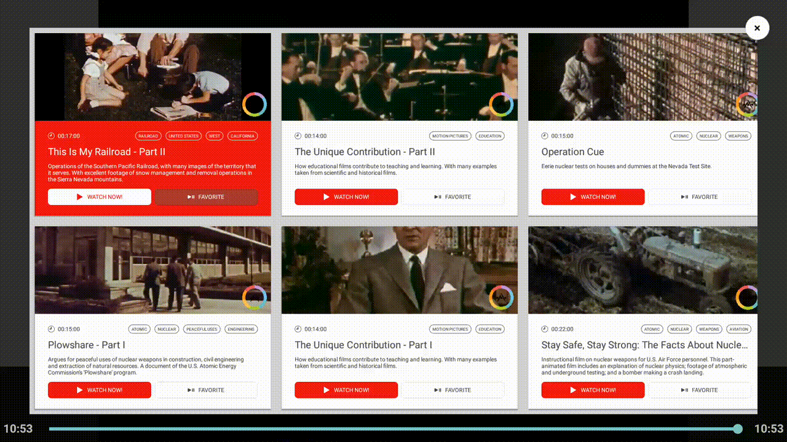
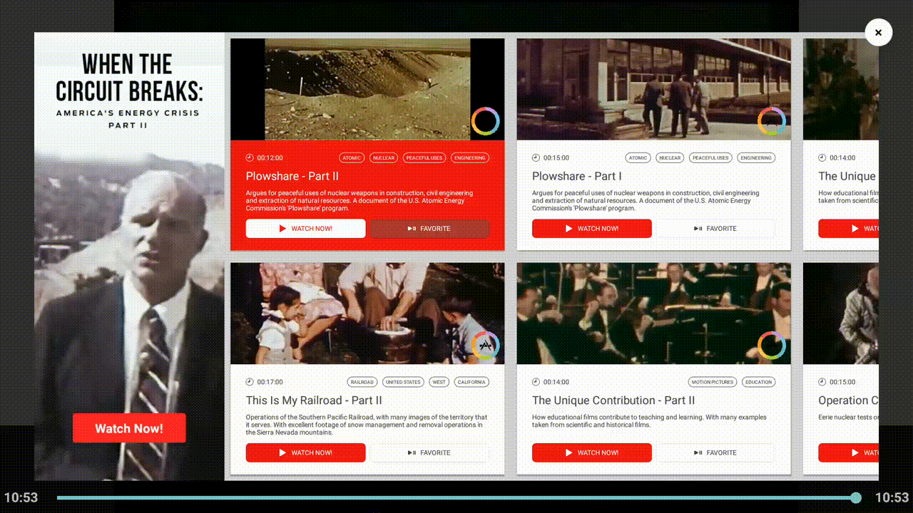
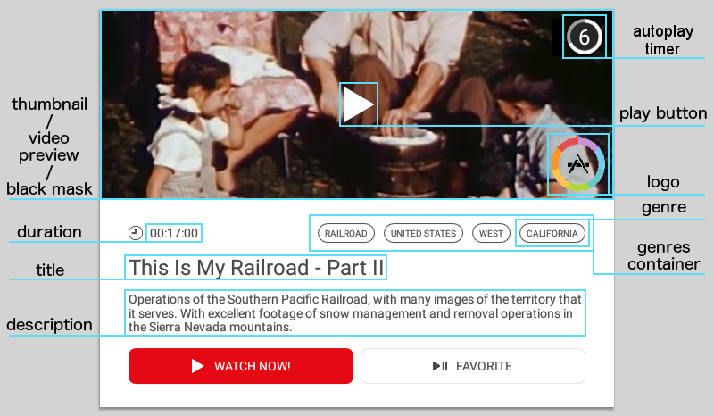
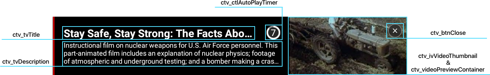
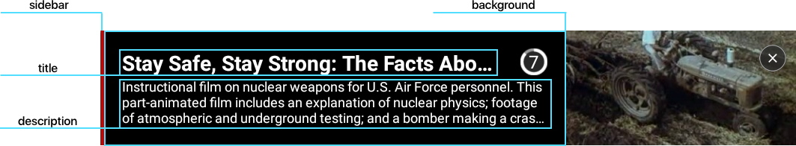

## Getting Started
Before getting started make sure you have:

* Added your app in the My Applications section of the Color Dashboard. You need to do this so that you can get your App ID that you'll be adding to your app with our SDK.

* Make sure your Android Studio version is up to date and that your application is targeting `minSdkVersion:14`

## Adding Android TV/Amazon Fire TV SDK

For a sample of the correct integration, please refer to our [sample application](https://github.com/color-tv/android-SampleApp)

### Connecting Your App

In your project's **build.gradle** make sure you are using ColorTV Bintray repository:

```groovy
repositories {
    maven {
        url  "http://colortv.bintray.com/maven"
    }
}
```

Then add the following dependencies in your app's **build.gradle** file in Android Studio:

```groovy
dependencies {
    compile 'com.colortv:android-sdk:4.1.0'
    compile 'com.google.android.gms:play-services-ads:10.2.0'
    compile 'com.google.android.gms:play-services-location:10.2.0' //optional
    compile 'com.android.support:recyclerview-v7:25.2.0'
}
```

!!! note ""
    The play-services-location dependency is only required if you want to anonymously track user location for better ad targeting

Doing this prevents you from having to download our SDK and adding it manually to your project, as the aar file will handle that for you.

## Initializing the SDK

Setup the ColorTvSDK by invoking `ColorTvSdk` initialization method.

```java
ColorTvSdk.init(this, "your_app_id_from_dashboard");
```

Your app id is generated in the publisher dashboard after adding an application in the My Applications section. Copy the app id and paste the value for "your_app_id_from_dashboard".

!!! note ""
    We recommend putting the initialization method inside **MainActivity.onCreate()**. The application must be initialized before invoking any functions of the SDK.

## Declaring Session

Creating a session is **necessary** for tracking user sessions and  virtual currency transactions. Add the following code to every Activity file in your application e.g. `MainActivity.java`

```java
// Start Session
@Override
protected void onCreate() {
  super.onCreate();
  ColorTvSdk.onCreate();
}

// End Session
@Override
protected void onDestroy() {
  super.onDestroy();
  ColorTvSdk.onDestroy();
}
```

## Placements

Placements are used to optimize user experience and analytics. Below are all predefined placement values used to indicate the specific location of Recommendation Center, UpNext and ads in your app:

- VideoStart
- VideoPause
- VideoStop
- VideoEnd
- AppLaunch
- AppResume
- AppClose
- MainMenu
- Pause
- StageOpen
- StageComplete
- StageFailed
- LevelUp
- BetweenLevels
- StoreOpen
- InAppPurchase
- AbandonInAppPurchase
- VirtualGoodPurchased
- UserHighScore
- OutofGoods
- OutofEnergy
- InsufficientCurrency
- FinishedTutorial

## Content Recommendations

!!! note ""
    Only for Content Providers

In order to control Content Recommendations you need to retrieve **ColorTvRecommendationsController** object by calling `ColorTvSdk.getRecommendationsController()` method. This object is a singleton, which allows loading and showing both **Recommendation Center** and **UpNext**, listening to events or managing assets preloading.

### Registering recommendations listener

To get callbacks about the content recommendation status, you need to create a `ColorTvRecommendationsListener` object by implementing it's methods:

```java
ColorTvRecommendationsListener recommendationsListener = new ColorTvRecommendationsListener() {

    @Override
    public void onLoaded(String placement) {
    }

    @Override
    public void onError(String placement, ColorTvError colorTvError) {
    }

    @Override
    public void onClosed(String placement, boolean watched) {
    }

    @Override
    public void onExpired(String placement) {
    }

    @Override
    public void onContentChosen(String videoId, String videoUrl, Map<String, String> videoParams) {
    }
};
```

!!! note ""
    The `videoParams` parameter of `onContentChosen` method contains any key-value pairs that you can specify to be passed here for each video in the feed.

After you create the listener, get the `ColorTvRecommendationsController` object:

```java
ColorTvRecommendationsController recommendationsController = ColorTvSdk.getRecommendationsController();
```

and register that listener to the SDK:

```java
recommendationsController.registerListener(recommendationsListener);
```

!!! note "WARNING"
    If you set up `videoUrl` as a deep link, then `onContentChosen` callback is invoked simultaneously to opening new activity with the deep link.

### Loading Content Recommendations

Before displaying recommendations in either **Recommendation Center** or **UpNext** you need to load recommendations related data from server. In order to do that you can invoke one of following methods:

```java
recommendationsController.load(ColorTvPlacements.VIDEO_END);

recommendationsController.load(ColorTvPlacements.VIDEO_END, previousVideoId);

recommendationsController.loadOnlyUpNext(ColorTvPlacements.VIDEO_END);

recommendationsController.loadOnlyUpNext(ColorTvPlacements.VIDEO_END, previousVideoId);
```

Use one of the predefined placements that you can find in `ColorTvPlacements` class, e.g. `ColorTvPlacements.VIDEO_END`.

Methods with `previousVideoId` parameter should be used when loading recommendations after playing a video in your app, as it allows to provide accurate recommendations. Video Id have to be the same as set in your feed shared with ColorTv. `load` methods can be used when using both **Recommendation Center** and **UpNext**. `loadOnlyUpNext` should be used when your intent is to use **UpNext** unit only, as it skips loading assets for **Recommendation Center**.

In case you would like to load recommendations just before showing them, you can decide to speed up the loading process by disabling assets prealoding. In this case you need to invoke the following method:

```java
recommendationsController.setPreloadingAssets(false);
```

It is not a recommended action, however, as the video previews won't be played due to a decrease in performance.

### Showing Content Recommendations

You can show Content Recommendations in one of two visual forms: **Recommendation Center** and **UpNext**.

#### Recommendation Center

Recommendation Center is a unit that lets you display recommendations in an Activity with scrollable grid layout form.

In order to show Recommendation Center, you have to call following method:

```java
recommendationsController.showRecommendationCenter(ColorTvPlacements.VIDEO_END);
```

Invoking this method will show Recommendation Center for the placement you pass. You need to call the `load` method for a given placement before invoking `showRecommendationCenter` in order to load recommendations related data. Also make sure you got the `onLoaded` callback first, otherwise the Recommendation Center won't be displayed.

```java
ColorTvRecommendationCenterFragment recommendationCenterFragment = colorTvRecommendationsController.getRecommendationCenterFragment(ColorTvPlacements.MAIN_MENU);
```

Invoking this method will return `ColorTvRecommendationCenterFragment` class (which inherits `android.support.v4.app.Fragment`) for the placement you pass. When you get the fragment you can put it in any place you want by using `FragmentManager`. It gives a lot of flexibility and capabilities to make Recommendation Center a part of your layout (i.e. you can add it between videos list, use it in vertical/horizontal layout).

**ColorTvRecommendationCenterFragment** provides few methods that allows you to make it work as you need.

```java
recommendationCenterFragment.setRequestFocusOnStart(boolean enabled)
```

This method is used to request focus on first element when Recommendation Center will completely load. Should be used before replacing/adding fragment. To make it work properly you should avoid setting this method to true in more than one fragment on the screen.

```java
recommendationCenterFragment.setConfig(ColorTvRecommendationCenterConfig config);
```

This method allows you to pass separate config for each fragment. We added a new `getCopy()` method to `ColorTvRecommendationCenterConfig`, which copies current config to new instance. If you need similar config it will be easier, faster and safer to copy config and change only differing parameter.

To make Recommendation Center work properly, you have to invoke the following methods in activity's `dispatchKeyEvent` and `dispatchTouchEvent` method which operates on received `ColorTvRecommendationCenterFragment`.

```java
recommendationCenterFragment.dispatchKeyEvent(KeyEvent keyEvent);
recommendationCenterFragment.dispatchTouchEvent(MotionEvent motionEvent);
```

If you're displaying more than one fragment at a time, you have to connect all fragments invocations of this methods by logical OR (||) operator, as in the example below.

```java
@Override
public boolean dispatchKeyEvent(KeyEvent event) {
    removeFragment(event);
    return (recommendationCenterFragment != null && recommendationCenterFragment.dispatchKeyEvent(event)) ||
            (recommendationCenterFragment2 != null && recommendationCenterFragment2.dispatchKeyEvent(event)) ||
            super.dispatchKeyEvent(event);
}

@Override
public boolean dispatchTouchEvent(MotionEvent event) {
    return (recommendationCenterFragment != null && recommendationCenterFragment.dispatchTouchEvent(event)) ||
            (recommendationCenterFragment2 != null && recommendationCenterFragment2.dispatchTouchEvent(event)) ||
            super.dispatchTouchEvent(event);
}
```

#### UpNext

UpNext is a unit which displays only the best recommendation in form of a view designed to be placed over a video. In order to keep the video playing we are delivering UpNext as a Fragment which you need to add to your layout.

In order to fetch UpNext fragment, you have to call following method:

```java
ColorTvUpNextFragment upNextFragment = recommendationsController.getUpNextFragment(Placements.VIDEO_END);
```

It should be previously loaded for a given placement with either `load` or `loadOnlyUpNext` methods. Unlike **Recommendation Center** the same **UpNext** can be displayed multiple times with the same server data as long as it isn't clicked. What is more when UpNext wasn't clicked it is possible to invoke `showRecommendationCenter` method. It is impossible to display **Recommendation Center** when **UpNext** is added, but if you call the `showRecommendationCenter` method, **Recommendation Center** will be opened as soon as UpNext is closed without clicking it.

Default layout can be located automatically at the bottom of a screen, taking its full width for mobiles and half of it on TVs and tablets. To make it work properly, you need to add a fragment container inside a RelativeLayout or a FrameLayout with width parameter set to `match_parent` in that view and all of its antecedents.

If you want to locate the default layout in some custom place you can invoke the following method on `ColorTvUpNextFragment`:

```java
upNextFragment.disableAutoLayoutPosition();
```

Height of the UpNext layout can be set to some specific value or it can be set proportionally to it's width (in case it changes depending on device type). In order to adjust height programmatically, container just need to have a height parameter set to `wrap_content` or `0`.

For a sample of the correct layout, please refer to our [sample application's layout](https://github.com/color-tv/android-SampleApp/blob/master/SampleApp/app/src/main/res/layout/activity_exo.xml). There are also more possibilities to [customize UpNext layout](#upnext-customization).

**UpNextFragment** provides a bunch of methods that allows you to manage **UpNext's** behaviour.

It is highly recommended to use the following method:

```java
upNextFragment.autoStart(getSupportFragmentManager(), R.id.flUpNextFragment, upNextStartBeforeVideoEndTime, shouldUseAutoPlay, new UpNextFragment.ColorTvVideoListener() {
                    @Override
                    public int getDurationInSeconds() {
                        return (int) TimeUnit.MILLISECONDS.toSeconds(videoView.getDuration());
                    }

                    @Override
                    public int getPositionInSeconds() {
                        return (int) TimeUnit.MILLISECONDS.toSeconds(videoView.getCurrentPosition());
                    }
                });
            }
```

It is designed to improve user experience provided by **UpNext** and lets you skip handling many cases by yourself. It automatically injects the fragment into the view container with given id, when video which it is related to is positioned at given amount of seconds before the end. It also removes **UpNext** when the video has been rewind to a position farther from video end than given in `secondsBeforeEnd`. It records all video pauses, for both buffering and controller invoked pause and it is pausing the auto play timer in such situations. When user forwards the video to a position closer than 3 seconds to the end, then auto play timer is set to `secondsBeforeEnd` value in order to give the user time to react to UpNext. Otherwise it is set to the amount of seconds remaining to the end of the video. When auto play countdown finishes, it automatically "clicks" an element invoking the `onContentChosen` callback. Position of the video is being read from `videoListener` which should return the current position of a video and its whole duration.

If auto start is no longer required it can also be canceled with the following method:

```java
upNextFragment.cancelAutoStart();
```

Auto playing can be disabled by `shouldUseAutoPlay` flag. Then it either waits for a click from the user, or can be handled with other methods such as:

```java
upNextFragment.setAutoPlayTimer(lengthInMillis, shouldStartAutomatically);

upNextFragment.startAutoPlayTimer();

upNextFragment.stopAutoPlayTimer();

upNextFragment.invokeClick();

upNextFragment.cancel();
```

These methods allow you to configure custom behaviour such as clicking **UpNext** at the video end, initiating auto play then; just clicking recommendation at video end without any timer; cancelling (removing) **UpNext** on some custom action, and many others.

`invokeClick` and `cancel` methods can be safely used when `autoStart` is used with `shouldUseAutoPlay`, although it is not recommended to use `setAutoPlayTimer`, `startAutoPlayTimer` and `stopAutoPlayTimer` in that case, as it may cause some unexpected behaviour.

##### UpNext's specific actions for TVs

Android TV requires focus handling and controlling with key events. It is why we've provided following methods:

```java
upNextFragment.requestFocus();

upNextFragment.dispatchKeyEvent();
```

By default UpNext requests focus when created, but in case of a necessity to change it, it is possible to gain focus back by calling `requestFocus` method.

There is no need to invoke `dispatchKeyEvent`, as the default behaviour based on focus with usage of `autoStart` works, although you may find it useful in your specific case. You need to add it to your activity's `dispatchKeyEvent` method. It dispatches `KEYCODE_DPAD_CENTER` and `KEYCODE_MEDIA_PLAY_PAUSE` invoking click on **UpNext**, and for other events removes the **UpNext** fragment. It doesn't dispatch `KEYCODE_BACK` and when **UpNext** is destroyed. It dispatches only `ACTION_DOWN` events. It is designed especially for media players that don't work properly on AndroidTv when there is some other view which is focused.

## Video Tracking

!!! note ""
    Only for Content Providers

In order to provide additional data for ColorTv Analytics and to improve Content Recommendation, you can report events related to your videos.

### Tracking Events

Below are all the tracking event values predefined in `ColorTvTrackingEventType` class:

- VIDEO_STARTED
- VIDEO_PAUSED
- VIDEO_STOPPED
- VIDEO_RESUMED
- VIDEO_COMPLETED

First, get the `ColorTvVideoTrackingController`:
```java
ColorTvVideoTrackingController videoTrackingController = ColorTvSdk.getVideoTrackingController();
```

You can report them by calling the following method:

```java
videoTrackingController.reportVideoTrackingEvent(videoId, ColorTvTrackingEventType.VIDEO_STOPPED, positionSeconds);
```

`videoId` is an id that you have set in your feed.
`positionSeconds` is a position at which the given event occur.

To report fast-forwarding or rewinding through the video, use `VIDEO_PAUSED` at the start and `VIDEO_RESUMED` at the end of the process.

If you are using ExoPlayer you can track your video events by calling the following method:

```java
videoTrackingController.setExoPlayerToTrackVideo(exoPlayer);
```

`exoPlayer` is your ExoPlayer instance.

If you are launching a video without using ColorTv Content Recommendation Center then you need to also call:

```java
videoTrackingController.setVideoIdForPlayerTracking(videoId);
```

with id of launched video that is set in your feed. In case you are using ColorTv Content Recommendation, the video id will be automatically taken from the chosen recommendation.

## Ads

!!! note "WARNING"
    Ads are provided only for AndroidTv devices.

Displaying ads is similar to displaying Recommendation Center. They may be shown wherever you place them inside your app, but you need to include a Placement parameter to indicate the specific location.

You can use the same Placements as are pointed in [Placements section](#placements).

!!! note ""
    You can choose what ad units you want to show for a specific placement in the dashboard, [click to learn more about Ad Units](index.md#ad-units)

To get callbacks about the ad status, you need to create a `ColorTvAdListener` object by overriding it's methods:

```java
ColorTvAdListener adListener = new ColorTvAdListener() {

        @Override
        public void onClosed(String placement, boolean watched) {
        }

        @Override
        public void onLoaded(String placement) {
        }

        @Override
        public void onError(String placement, ColorTvError error) {
        }

        @Override
        public void onExpired(String placement) {
        }
};
```

After you create the listener, get the `ColorTvAdController` object:

```java
ColorTvAdController adController = ColorTvSdk.getAdController();
```

and register that listener to the SDK:

```java
adController.registerListener(adListener);
```

To load an ad for a certain placement, you need to call the following method:

```java
adController.load(ColorTvPlacements.LEVEL_UP);
```

Use one of the predefined placements that you can find in `ColorTvPlacements` class, e.g. `ColorTvPlacements.LEVEL_UP`.

In order to show an ad, call the following function:

```java
adController.show(ColorTvPlacements.LEVEL_UP);
```

Calling this method will show an ad for the placement you pass. Make sure you get the `onLoaded` callback first, otherwise the ad won't be played.

!!! note ""
    It is recommended to set up multiple placements inside your app to maximize monetization and improve user experience.  

## Earning Virtual Currency

A listener must be added in order to receive events when a virtual currency transaction has occurred.

```java
private ColorTvCurrencyEarnedListener listener = new ColorTvCurrencyEarnedListener() {
    @Override
    public void onCurrencyEarned(String placement, int currencyAmount, String currencyType){

    }
};

...

adController.addCurrencyEarnedListener(listener);
```

Use the following function to unregister listeners:

```java
adController.removeCurrencyEarnedListener(listener);
```

Use the following function to cancel all listeners:

```java
adController.clearCurrencyEarnedListeners();
```

!!! note "Reminder!"
    Session must also be implemented for virtual currency transactions to function.

### Currency for user

In order to distribute currency to the same user but on other device, use below:
```java
ColorTvSdk.setUserId("user123");
```

## INSTALL_REFERRER Conflict

If any of your `BroadcastReceiver` class declared in `AndroidManifest.xml` contains Intent Action `INSTALL_REFERRER`:

```xml
<receiver ...>
  <intent-filter>
    <action android:name="com.android.vending.INSTALL_REFERRER"/>
  </intent-filter>
</receiver>
```

Add the following code to your `AndroidManifest.xml` file:

```xml
<receiver android:name="com.colortv.android.ColorTvBroadcastReceiver">
```

In your BroadcastReceiver that handles action **com.android.vending.INSTALL_REFERRER**, add Java code:

```java
if (intent.getAction().equals("com.android.vending.INSTALL_REFERRER")) {
  final String referrer = intent.getStringExtra("referrer");
  ColorTvSdk.registerReferrer(context, referrer);
}
```

## User profile

To improve ad targeting you can use the `ColorTvUserProfile` class. To do so, get the reference to this class:

```java
ColorTvUserProfile user = ColorTvSdk.getUserProfile();
```

You can set age, gender, email and some keywords as comma-separated values like so:

```java
user.setAge(24);
user.setGender(UserProfile.Gender.FEMALE);
user.setEmail("sample@mail.com");
user.setKeywords("sport,health");
```

These values will automatically be saved and attached to an ad request.

## Disabling voice input on phone fields

If you don't want to use the voice input functionality add the following line to your manifest:

```xml
<uses-permission android:name="android.permission.RECORD_AUDIO" tools:node="remove" />
```

and call the following method after the `ColorTvSdk.init()`:

```java
ColorTvSdk.setRecordAudioEnabled(false);
```

## Summary

After completing all previous steps your Activity could look like this:

```java
import com.colortv.android.api.ColorTvPlacements;
import com.colortv.android.api.ColorTvSdk;
import com.colortv.android.api.ColorTvError;
import com.colortv.android.api.listener.ColorTvAdListener;
import com.colortv.android.api.listener.ColorTvRecommendationsListener;
import com.colortv.android.api.listener.ColorTvCurrencyEarnedListener;
import com.colortv.android.api.controller.ColorTvAdController;
import com.colortv.android.api.controller.ColorTvRecommendationsController;

public class MainActivity extends Activity {

    private ColorTvAdController adController;
    private ColorTvRecommendationsController recommendationsController;

    private ColorTvAdListener adListener = new ColorTvAdListener() {

        @Override
        public void onClosed(String placement, boolean watched) {
        }

        @Override
        public void onLoaded(String placement) {
            adController.show(placement);
        }

        @Override
        public void onError(String placement, ColorTvError colorTvError) {
        }

        @Override
        public void onExpired(String placement) {
        }
    };

    private ColorTvRecommendationsListener recommendationListener = new ColorTvRecommendationsListener() {

        @Override
        public void onLoaded(String placement) {
            recommendationsController.showRecommendationCenter(placement);
        }

        @Override
        public void onError(String placement, ColorTvError colorTvError) {
        }

        @Override
        public void onClosed(String placement, boolean watched) {
        }

        @Override
        public void onExpired(String placement) {
        }

        @Override
        public void onContentChosen(String videoId, String videoUrl, Map<String, String> videoParams) {
            //play video with videoId, kept under videoUrl
        }
    };

    @Override
    protected void onCreate(Bundle savedInstanceState) {
        super.onCreate(savedInstanceState);
        setContentView(R.layout.activity_main);

        ColorTvSdk.init(this, "your_app_id");

        recommendationsController = ColorTvSdk.getRecommendationsController();
        recommendationsController.registerListener(recommendationListener);

        findViewById(R.id.btnShowContentRec).setOnClickListener(new View.OnClickListener() {
            @Override
            public void onClick(View v) {
                recommendationsController.load(ColorTvPlacements.VIDEO_START);
            }
        });

        adController = ColorTvSdk.getAdController();
        adController.registerListener(adListener);

        findViewById(R.id.btnShowAd).setOnClickListener(new View.OnClickListener() {
            @Override
            public void onClick(View v) {
                adController.load(ColorTvPlacements.APP_LAUNCH);
            }
        });

        adController.addCurrencyEarnedListener(new ColorTvCurrencyEarnedListener() {
            @Override
            public void onCurrencyEarned(String placement, int currencyAmount, String currencyType) {
                Toast.makeText(MainActivity.this, "Received " + currencyAmount + " " + currencyType, Toast.LENGTH_LONG).show();
            }
        });

        ColorTvSdk.onCreate();
    }

    @Override
    protected void onDestroy() {
        super.onDestroy();

        ColorTvSdk.onDestroy();
        ColorTvSdk.clearCurrencyEarnedListeners();
    }
}
```

## Customization

There is possibility to customize both Recommendation Center and UpNext layouts. In order to do it, you need to use `ColorTvRecommendationCenterConfig`, which provides methods that allow you to change default recommendation layouts into custom ones.

You can retrieve the global config object from `ColorTvRecommendationsController` instance:

```java
ColorTvRecommendationsController recommendationsController = ColorTvSdk.getRecommendationsController();
ColorTvRecommendationCenterConfig recommendationConfig = recommendationsController.getConfig();
```

Most of its methods take `Device` enum type as one of arguments. It is nested inside the `ColorTvRecommendationCenterConfig` class. It can be one of: `TV`, `MOBILE` and `TABLET`. It lets you to set various settings for different device types. In order to set custom layouts, you need to provide android layout id leading to aprropriate resource. Process of designing is similar to the usual layout creation. You can use all types of Views or Layouts, but in order to have injected some recommendations data into them, you need to use some specified ids assigned to proper view types. Although you don not need to use them all and you can add as many additional views as you want.

!!! note ""
    All settings are stored in singleton config which is shared between all recomendation units. We recommend to use `getCopy` method on the global config if you are using Recommendation Center as fragments to not mix global config with fragments configs. In order to restore default layouts you need to invoke `recommendationConfig.resetToDefault()` method.


### Recommendation Center customization

In Recomendation Center it is possible to customize both RecyclerView and items it contains. You can change one, both or use the default. You can also change number of rows used in RecyclerView, or enable snapping an item on mobiles. You can do it by invoking following methods:

```java
recommendationConfig.setGridLayout(Device device, @LayoutRes int layoutResId);
recommendationConfig.setItemLayout(Device device, @LayoutRes int layoutResId);
recommendationConfig.setRowCount(Device device, int rowCount);
recommendationConfig.setSnapEnabled(boolean enabled);
```

All methods (except for `setSnapEnabled` - only mobile) are applicable to TV, mobile and tablet devices. `Device` enum is nested inside the `ColorTvRecommendationCenterConfig` class.

#### setGridLayout(Device device, @LayoutRes int layoutResId)

This method is used to set custom grid layout for specified device type. You can add additional images, texts etc. We will handle the following views if they're available:

<details><summary>Available IDs</summary>


#### **ID:** ctv_rvGrid
* **View type:** `android.support.v7.widget.RecyclerView`
* **Description:** Contains recommendation items.
* **Device:** ALL
<br /><br />


#### **ID:** ctv_ivFavoriteContainer
* **View type:** Any view extending the View class (eg. `LinearLayout`, `ImageView`).
* **Description:** Appears when user presses the play-pause remote button on TV or taps on `ImageView` with id `ctv_ivFavoriteIcon` on Mobile/Tablet if available.
* **Animation:** Is displayed and scales up for 1 second.
* **Device:** ALL



#### **ID:** ctv_featuredUnitLayoutContainer
* **View type:** Any view extending the View class (eg. `LinearLayout`, `ImageView`), `FrameLayout` is recommended.
* **Description:** Used to inject featured content if available. It is not recommended to add any child views.
* **Device:** TV



#### **ID:** ctv_ivGridClose
* **View type:** `ImageView`
* **Description:** Used to close the recommendation center.
* **Animation:** Scales up on focus, scales down on unfocus.
* **Device:** TV
<br /><br />


#### **ID:** ctv_layoutSubscriptionFragment
* **View type:** Any view extending the View class (eg. `LinearLayout`, `ImageView`), `FrameLayout` recommended
* **Description:** Subscription fragment is injected into this view. It is an overlay view, which appears when user clicks on an element containing a subscription offer and allows user to type phone no./email address and subscribe. We do not recommend to add any child views.
* **Device:** TV

!!! note ""
    If you are using the default item layout and you only want to change the grid layout, the RecyclerView height should be match_parent or defined. If your custom item layout has defined sizes you can use wrap_content.

</details>

Check the default TV [grid layout](https://github.com/color-tv/android-SampleApp/blob/master/SampleApp/app/src/main/res/layout/colortv_default_grid_layout.xml) for better a understanding of the customization options.

#### setItemLayout(Device device, @LayoutRes int layoutResId)

This method is used to set a custom item layout for specified device type. You can add additional images, texts etc. All views are animated if they contain selectors with the default state and state_selected (TV only).

All the views available are outlined on the following image:



<details><summary>Available IDs</summary>


#### **ID:** ctv_hide
* **View type:** Any view extending the View class (eg. `LinearLayout`, `ImageView`)
* **Description:** Used to hide views on focus and show them on unfocus. Use any layout if you would like to hide more than one view.
* **Animation:** Hides (`Visibility.GONE`) the view and its child views on focus and shows them on unfocus.
* **Device:** TV
<br /><br />


#### **ID:** ctv_show
* **View type:** Any view extending the View class (eg. `LinearLayout`, `ImageView`)
* **Description:** Used to show views on focus and hide them on unfocus. Use any Layout if you would like to show more than one view.
* **Animation:** Shows (`Visibility.VISIBLE`) the view and its child views on focus and hides them on unfocus.
* **Device:** TV
<br /><br />


#### **ID:** ctv_ctlAutoPlayTimer
* **View type:** View extending `ColorTvTimerLayout` or `ViewGroup` (eg. `FrameLayout`, `LinearLayout`) which can be either empty or include elements as described in [Custom Timer Layout](#custom-timer-layout)
* **Description:** Used to display countdown timer which visualizes time left until recommendation is automatically clicked. If it extends `ColorTvTimerLayout` then its implementation is used for handling timer progress events. If it is `FrameLayout` with `ProgressBar` view with id `ctv_pbTimer` and `TextView` view with id `ctv_tvTimer` they are updated in a default way. All views included into such `FrameLayout` are also hidden when auto play timer is not used. In case the view is a `FrameLayout` with no children, default countdown timer layout is injected into it.
* **Animation:** Hides when auto play timer reaches 0 or user click button or touch screen.
* **Device:** ALL
<br /><br />


#### **ID:** ctv_videoPreviewContainer
* **View type:** Any view extending the ViewGroup class (eg. `LinearLayout`, `RelativeLayout`)
* **Description:** Used to inject our `VideoPlayer` for previews playback. Check our [custom layout](https://github.com/color-tv/android-SampleApp/blob/master/SampleApp/app/src/main/res/layout/custom_item_layout_2.xml) if you would like to oversize the preview video.
* **Animation:** Plays the preview and hides the thumbnail on focus (only if the preview is available) and stops playing the preview and shows the thumbnail on unfocus.
* **Device:** ALL
<br /><br />


#### **ID:** ctv_ivVideoThumbnail
* **View type:** `ImageView`
* **Description:** Used to display the video thumbnail.
* **Animation:** If there is preview available and `ctv_videoPreviewContainer` is present in the layout it hides on focus and shows on unfocus
* **Device:** ALL
<br /><br />


#### **ID:** ctv_ivAppLogo
* **View type:** `ImageView`
* **Description:** Used to display your app's logo.
* **Device:** ALL
<br /><br />


#### **ID:** ctv_ivPlayButton
* **View type:** `ImageView`
* **Description** Used to point out that focusing an element will cause playing a preview.
* **Animation:** Hides on focus and shows on unfocus.
* **Device:** ALL
<br /><br />


#### **ID:** ctv_ivBlackMask
* **View type:** `ImageView`
* **Description** Used to cover unfocused thumbnail images with semi transparent mask to highlight the focused item.
* **Animation:** Hides on focus and shows on unfocus.
* **Device:** ALL
<br /><br />


#### **ID:** ctv_tvTitle
* **View type:** `TextView`
* **Description:** Displays the video title.
* **Device:** ALL
<br /><br />


#### **ID:** ctv_tvDescription
* **View type:** `TextView`
* **Description:** Displays the video description.
* **Device:** ALL
<br /><br />


#### **ID:** ctv_tvDuration
* **View type:** `TextView`
* **Description:** Displays the video duration.
* **Device:** ALL
<br /><br />


#### **ID:** ctv_tvGenre
* **View type:** `TextView`
* **Description:** Defines how each genre should look like. Visibility must be set to `Visibility.GONE`.
* **Device:** ALL
<br /><br />


#### **ID:** ctv_llGenres
* **View type:** `LinearLayout`
* **Description:** Used to contain genres, which will look like the `TextView` with id `ctv_tvGenre`.
* **Device:** ALL
<br /><br />


#### **ID:** ctv_ivFavoriteIcon
* **View type:** `ImageView`
* **Description:** Shows `ctv_ivFavoriteContainer` on click.
* **Device:** MOBILE

</details>

Check our example [item layouts](https://github.com/color-tv/android-SampleApp/tree/master/SampleApp/app/src/main/res/layout) for better a understanding of the customization options.

#### setRowCount(Device device, int rowCount)

This method is used to set the number of rows in RecyclerView with id `ctv_rvGrid` for a specified device type.

#### setSnapEnabled(boolean enabled)

This method is used to set snapping `RecyclerView` elements to the center of the screen. Available only on Mobile. We recommend to disable this option if the width of the elements is too small and the first or the last item is impossible to be snapped.

- true - items snap to the center of the `RecyclerView`, video preview is enabled and will be shown if available.
- false - list scrolls freely, video preview is disabled and will not be shown whether it is available or not.

### Both Recommendation Center and UpNext related customization

Following config methods has influence on both Recommendation Center and UpNext customization:

```java
recommendationConfig.setFont(Device device, Typeface typeface);
recommendationConfig.resetToDefault();
recommendationConfig.getCopy();
```

#### setFont(Device device, Typeface typeface)

This method is used to set a custom font for a specified device type. It only works if you don't use a custom item layout.

#### resetToDefault()

This method is used to reset all settings to defaults.

#### getCopy()

This method is used to copy current config to a new instance.

For an example of the usage of all of the above methods, check our [custom recommendation center sample](https://github.com/color-tv/android-SampleApp/blob/master/SampleApp/app/src/main/java/com/colortv/sample/CustomRecommendationCenterActivity.java).

### UpNext customization

It is possible to customize UpNext in 2 ways:

- setting custom layout for UpNext
- changing colors of default layout through public interface

#### Using custom layout

In order to set custom layout for UpNext you should do it appropriately to Recommendation Center using following method of `ColorTvRecommendationCenterConfig` instance:

```java
recommendationConfig.setUpNextLayout(Device device, @LayoutResource int layoutResId);
```

This method is used to set a custom UpNext layout for specified device type. You can use some specified views with proper ids in that layout, which will be handled by the sdk (some recommendations data will be injected into them), but you can also add as many additional views as you want.

Most of the available handled views are outlined on the following image:



<details><summary>Available IDs</summary>

#### **ID:** ctv_upNext
* **REQUIRED**
* **View type:** Any view extending the ViewGroup class (eg. `LinearLayout`, `FrameLayout`)
* **Description:** Used as a container of UpNext layout. All content views need to be inserted into that view. If there is no `ctv_vClickable` view then `ctv_upNext` is used to gain focus and capture clicks.
* **Device:** ALL
<br /><br />


#### **ID:** ctv_ctlAutoPlayTimer
* **View type:** View extending `ColorTvTimerLayout` or `ViewGroup` (eg. `FrameLayout`, `LinearLayout`) which can be either empty or include elements as described in [Custom Timer Layout](#custom-timer-layout)
* **Description:** Used to display countdown timer which visualizes time left until recommendation is automatically clicked. If it extends `ColorTvTimerLayout` then its implementation is used for handling timer progress events. If it is `FrameLayout` with `ProgressBar` view with id `ctv_pbTimer` and `TextView` view with id `ctv_tvTimer` they are updated in a default way. All views included into such `FrameLayout` are also hidden when auto play timer is not used. In case the view is a `FrameLayout` with no children, default countdown timer layout is injected into it.
* **Animation:** Hides when auto play timer reaches 0.
* **Device:** ALL
<br /><br />

#### **ID:** ctv_videoPreviewContainer
* **View type:** Any view extending the ViewGroup class (eg. `LinearLayout`, `FrameLayout`)
* **Description:** Used to inject our `VideoPlayer` for previews playback.
* **Animation:** Plays the preview and hides the thumbnail when video preview is enabled in UpNext interface (only if the preview is available).
* **Device:** ALL
<br /><br />

#### **ID:** ctv_ivVideoThumbnail
* **View type:** `ImageView`
* **Description:** Used to display the video thumbnail.
* **Animation:** If there is preview available and `ctv_videoPreviewContainer` is present in the layout it is hidden when the preview is enabled in UpNext interface.
* **Device:** ALL
<br /><br />

#### **ID:** ctv_tvTitle
* **View type:** `TextView`
* **Description:** Displays the video title.
* **Device:** ALL
<br /><br />


#### **ID:** ctv_tvDescription
* **View type:** `TextView`
* **Description:** Displays the video description.
* **Device:** ALL
<br /><br />


#### **ID:** ctv_tvDuration
* **View type:** `TextView`
* **Description:** Displays the video duration.
* **Device:** ALL
<br /><br />


#### **ID:** ctv_tvSeries
* **View type:** `TextView`
* **Description:** Displays series name when recommending series.
* **Device:** ALL
<br /><br />


#### **ID:** ctv_tvSeason
* **View type:** `TextView`
* **Description:** Appends series season number to contained by the view text, while recommending series. I.e. when TextView has set in XML file a text "Season: " it will append season number creating "Season: 1".
* **Device:** ALL
<br /><br />


#### **ID:** ctv_tvEpisode
* **View type:** `TextView`
* **Description:** Appends series episode number to contained by the view text, while recommending series. I.e. when TextView has set in XML file a text "Episode: " it will append episode number creating "Episode: 1".
* **Device:** ALL
<br /><br />


#### **ID:** ctv_clickable
* **View type:** Any view extending the View class (eg. `LinearLayout`, `Button`)
* **Description:** Element used to capture click on recommendation, which invokes `onContentChosen` callback. If this element is absent `ctv_upNext` is such element. It should only be used when having other views in UpNext, which can be focusable and clickable. For TVs it should use some selector in order to give feedback to a user that the focus has been changed.
* **Device:** ALL
<br /><br />


#### **ID:** ctv_btnClose
* **View type:** Any view extending the View class (eg. `LinearLayout`, `ImageView`)
* **Description:** Element used to close UpNext on click. For TVs it should use some selector in order to give feedback to a user that the focus has been changed.
* **Device:** ALL
<br /><br />

#### **ID:** ctv_openRecCenter
* **View type:** Any view extending the View class (eg. `LinearLayout`, `ImageView`)
* **Description:** Element used to close UpNext and open Recommendation Center on click. For TVs it should use some selector in order to give feedback to a user that the focus has been changed.
* **Device:** ALL
<br /><br />

#### **ID:** ctv_upNextContainer
* **View type:** Any view extending the ViewGroup class (eg. `LinearLayout`, `FrameLayout`)
* **Description:** Used to automatically locate UpNext fragment at the bottom of the screen when its parent is `RelativeLayout` or `FrameLayout`. If the view is an instance of `LinearLayout` and contains views with ids: `ctv_space` and `ctv_upNext`, then it sets weight of that elements to take half of a screen on TVs and tablets, and full screen on mobiles.
* **Device:** ALL
<br /><br />

#### **ID:** ctv_space
* **View type:** Any view extending the View class, however `Space` class is recommended.
* **Description:** If the view is a child of `ctv_upNextContainer` `LinearLayout` and sibling of `ctv_upNext` then it is used to change width of UpNext to take just half of a screen on TVs and tablets.
* **Device:** ALL
<br /><br />

</details>

#### Programmable customization

In order to change the look and feel of the default UpNext layout, you can use `ColorTvUpNextUiCustomizer` class which can be fetched from `ColorTvUpNextFragment`:

```java
ColorTvUpNextUiCustomizer uiCustomizer = upNextFragment.getUiCustomizer();
```

`ColorTvUpNextUiCustomized` provides the following methods:

```java
uiCustomizer.setSidebarColorRes(@ColorRes int resId);
uiCustomizer.setSidebarColor(@ColorInt int sideBarColor);
uiCustomizer.setBackgroundColorRes(@ColorRes int resId);
uiCustomizer.setBackgroundColor(@ColorInt int backgroundColor);
uiCustomizer.setTitleColorRes(@ColorRes int resId);
uiCustomizer.setTitleColor(@ColorInt int textColor);
uiCustomizer.setDescriptionColorRes(@ColorRes int resId);
uiCustomizer.setDescriptionColor(@ColorInt int descriptionColor);
```

Visualization of all changeable elements is outlined on the following image:



#### Custom Timer Layout

You can include into your custom layouts a view which displays progress until recommendation will be chosen automatically. You can do it in 3 different ways:

- by adding empty `FrameLayout` with id `ctv_ctlAutoPlayTimer`. Then the default auto play timer is injected into such view.
- by adding `FrameLayout` with id `ctv_ctlAutoPlayTimer` with some custom views, among which there can be `TextView` with `ctv_tvTimer` id and `ProgressBar` with `ctv_pbTimer` id. In such situation proper seconds number will be set into `ctv_tvTimer` and progres will be updated in `ctv_pbTimer`. Also in case when timer should be hidden, visibility of all `ctv_ctlAutoPlayTimer` children is set to `GONE` and if it should be shown its visibility is set to `VISIBLE`.
- by adding a view which extends `ColorTvTimerLayout`. It can be used in order to define custom behaviour for showing, hiding the timer, or to set values in some custom way. When extending `ColorTvTimerLayout` it is necessary to implement following methods:

```java
public void setTotalMillis(int millis);
public void setProgress(int millisUntilFinished);
public void onTimerFinished();
public void hide();
public void show();
```
