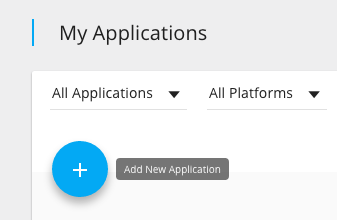
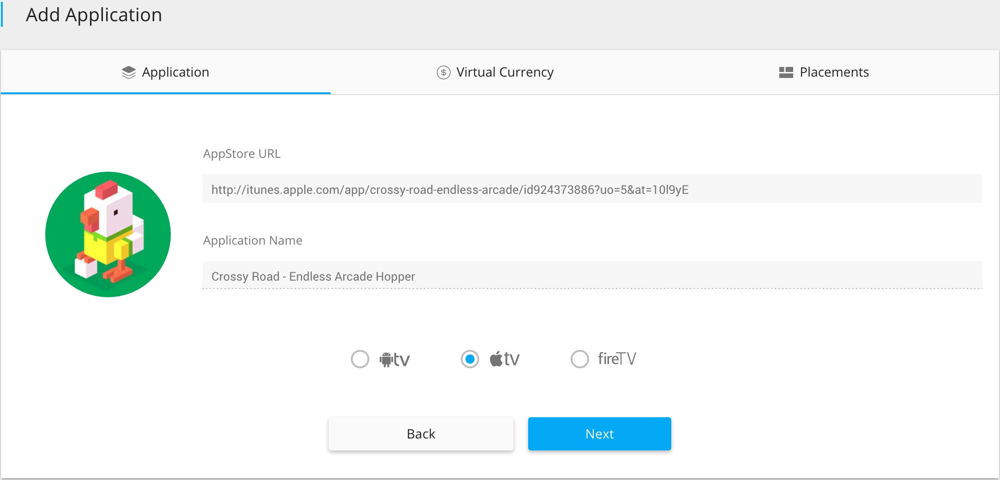

Welcome to the home of ColorTV's documentation. You'll find tons of information here, topics ranging from navigating through the dashboard to integrating your app with our SDK. If you can't find what you are looking for, click the button in the bottom right corner to chat with our team, or email us at support@colortv.com

##Adding an Application
Navigate to the My Applications section in the Publisher Dashboard. To add a new application, click the plus button. 

Copy and paste the tvOS, Android TV, or Amazon Fire TV app store URL for your application and all the details of your app will be gathered and displayed. 

If you want to integrate a virtual currency from you can configure it in the next tab. First enter your virtual currency name and value. The value of your virtual currency should be the amount per $1 e.g. 100 gems, 2 spins, etc. Then choose whether you would like to have a Client Side or Server Side callback and configure either appropriately. 

Next you can choose if you would like to join our Open Marketplace. Our Open Marketplace allows you to gain more users and traction to your app by helping promote other apps. The discovery potential of your app is dependant on how well you promote other apps: the more your users download other apps in the marketplace, the more users you will gain!

Lastly you must choose what type of content you want to be shown at specific placements in your application.  
!!! note "Placements"
    A placement is a specific time or location in your application where you might want to display Replay content to your users.
    
    You can find out more specifics about placements and how to incorporate them in your app [here](androidTVSDK.md#showing-ads)
    In order to show an ad, you must declare the placement in the ad request inside of your code.
##Ad units

###Discovery Center
Discovery Center amplifies the finite amount of content in the App Store to provide users with an extended amount of app, video, and brand recommendations. The duel functionality of the Discovery Center helps cater to all types of developers by serving as a free-marketplace to increase your app's reach or a tool for monetization. Our discovery platform uses machine learning to deliver the most relevant suggestions to your users in a non-intrusive manner.

Configure the way you want to utilize the Discovery Center for your apps in the My Applications section of the dashboard by selecting the option to join our open-marketplace or integrate your virtual currency to monetize. If you are using the monetization component, you will be notified by the SDK that the transaction was successful and your users will be credited by either client or server side callbacks. 

###Game Trailer
Game Trailer gives users an immersive experience with one of our featured applications. Scroll through the assortment of images to get insight to the gameplay and functionality of the app,  description and app ratings further helps users determine whether the app will appeal to them. The Game Trailer unit also supports showing video before to further enhance the user's experience with the app. 

!!! note "Maximize Revenue"
    In order to maximize monetization, select both Video and Game Trailer for your placement in the My Applications section. This enables a video preview for the app to play before the Game Trailer screen is displayed.

###Brand Engagement
Brand Engagement transcends the normal television branded ad by allowing users to interact and engage with the product. By entering either their phone number or email address, users will be connected to a brand representative to find out more about the specific offer. By entering their email, users will be added to a mailing list for the product to get updates and exclusive offers. Entering their phone number will result in a representative calling within a few minutes to provide more information about the product. Brand Engagement also supports showing video before to further enhance the user's experience with the product. 

!!! note "Maximize Revenue"
    In order to maximize monetization, select both Video and Brand Engagement for your placement in the My Applications section. This will enable a video preview for the product to play before the Brand Engagement screen is displayed.
    

###Video
The Video unit can be employed in a variety of ways, either as a standalone unit or as a supplement to the Game Trailer and Brand Engagement units. Video ranges from 15 seconds to a minute and can be configured in the My Applications section of the dashboard.

##Placements
Placements are specific times or locations inside of your app where you can choose to show content to your users. Here is the list of available placements: 

!!! note "Defined Placement Values"
  * AppLaunch
  * AppResume
  * AppClose
  * MainMenu
  * Pause
  * StageOpen
  * StageComplete
  * StageFailed
  * LevelUp
  * BetweenLevels
  * StoreOpen
  * InAppPurchase
  * AbandonInAppPurchase
  * VirtualGoodPurchased
  * UserHighScore
  * OutofGoods
  * OutofEnergy
  * InsufficientCurrency
  * FinishedTutorial
  
By setting up placements inside your app, you will have the ability to control what type of ad units are being shown at specific locations in your app in real-time server side. In addition to added control, our machine learning algorithm optimizes the best performing ad units for specific times: Making more relevant content displayed to your users and maximizing revenue for you. It is recommended that you select all ad units to maximize revenue for your placements.
##Payments
Payment information must be filled out before getting paid. Navigate to the Payments section of the dashboard and click on the settings icon above the table to edit or update your payment information. 

Payments are paid out by either Paypal or a Wire transfer. Contact your account manager if you would like to receive payments by Wire.
##Referrals
Payment information must be filled out before getting paid. Navigate to the Payments section of the dashboard and click on the settings icon above the table to edit or update your payment information. 

Payments are paid out by either Paypal or a Wire transfer. Contact your account manager if you would like to receive payments by Wire.
