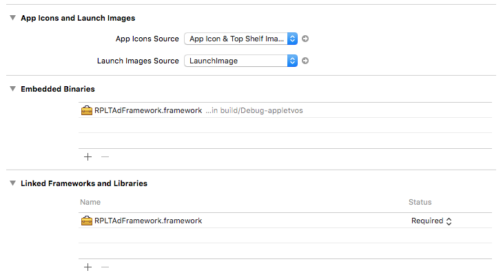

##Getting Started
Before getting started make sure you have: 

* Added your app in the My Applications section of the Color Dashboard. You need to do this so that you can get your App ID that you'll be adding to your app with our SDK.

* Our newest tvOS SDK supports the newest Xcode (x). Please ensure you are using Xcode (x) or higher to ensure smooth integration.
##Adding tvOS SDK
###Connecting Your App
There are two ways to add Color to your Xcode project:

####1) Cocoapods
Easily add Color to your project by adding the following code to your Podfile:
```objc
pod "value" 
```
After adding this value, run *pod install* and the latest version of our tvOS SDk will be installed! Skip to the Initializing SDK section in our guide. 

####2) Manual Integration
!!! note "tvOS SDK Download"
       [Downoad the tvOS SDK here](http://google.com)

###Download & Unzip SDK 
Drag and drop the RPLTAdFramework.framework directory into Xcode under *Frameworks*.
Open your project in Xcode and go to project settings. Select *General* and choose proper target, it name in most cases corresponds to name of your project.

<center></center>

Expand *Embedded Binaries* section and click + icon. Add RPLTAdFramework to your project. Please note that the framework will be automatically added to *Linked Frameworks and Libraries*. It will **not** happen if you add it to Linked Frameworks and Libraries first.
##Initializing SDK
Open AppDelegate.m and modify body of function application:DidFinishLaunchingWithOptions:
```objectivec
[[RPLTAdController sharedAdController] startWithAppIdentifier:@"566dbd1a326aeb750132fdfb"];
```
Remember to import RPLTAdFramework module. Add following line of code above class implementation.
```objectivec
@import RPLTAdFramework;
```
##Displaying Ads
Replay offer lot of different types of advertisement which are automatically provided by our server in order to attract you audience. You do not need to care about proper ad and its content. We do it for you. All you need to do is to type a few lines of code to have the ad displayed wherever and whenever you want.
```objectivec
[[RPLTAdController sharedAdController] adViewControllerWithCompletion:^(RPLTAdViewController * _Nullable vc, NSError * _Nullable error) {
        if(vc) {

            vc.adCompleted = ^{
                dispatch_async(dispatch_get_main_queue(), ^{
                    [self dismissViewControllerAnimated:YES completion:nil];
                });
            };

            dispatch_async(dispatch_get_main_queue(), ^{                
                [self presentViewController:vc animated:YES completion:^{
                    
                }];
            });
        } else {
            NSLog(@"Error: %@", error);
        }        
    }];
```
A few words of explanation are probably required here. We care about user experience a lot. Nobody wants to wait a few seconds just to see an advertisement regardless how attractive its content is. Call a method named adViewControllerWithCompletion whenever you think an ad is likely to be shown. Completion block is called when some elements of ad are loaded.
It provides you two arguments, viewController and error. Let's concentrate on the first one. Basically the framework generates viewController which is to be displayed in the manner which matches your application's structure. In most cases modal view controller is OK but sometimes navigation view controller or some kind if embedded view controller will be better. It is up to you.

When we believe that ad should not longer be displayed you will be informed accordingly. Please define completion block. In the example above that controller is simply dismissed from screen.

Please note that majority of operations are done on the background threads while interactions with User Interface are to be made only on the main thread. Remember to use [NSThread mainThread] (old style) or main queue from GDC (new style) when interacting with UI.
##Earning Virtual Currency
Your audience is more likely to interact with presented ads if something in reward is given. We offer a mechanism to provide end user a variety of incentives based on so-called virtual currency. All settings required are to be done in administration panel provided for your application. Your application needs only a few lines of code more to enable features or add some gems to user's collection.
Ads conversion are monitored in background, you will be informed when some currency is assigned. It is up to you whether you prefer to get notification through NSNotificationCenter or use delegate pattern.
```objectivec
[[NSNotificationCenter defaultCenter] addObserverForName:RPLTAdFrameworkNotificationDidGetCurrency object:nil queue:nil usingBlock:^(NSNotification * _Nonnull note) {
        NSLog(@"userInfo: %@", note);
    }];
```
Each time positive conversion is registered (usually when application returns to foreground) notification will be triggered for each conversion separately. Note is an object of class NSNotification which contains property userInfo of class NSDictionary. It contains some useful information like amount of currency to be assigned or name of the currency.
```objectivec
@interface AppDelegate ()<RPLTAdControllerDelegate>

@end
```
If you prefer to use delegates please remember to set desired class as compliant to RPLTAdControllerDelegate protocol. Then set the delegate.
```objectivec
[RPLTAdController sharedAdController].delegate = self;
```
Whenever conversion is registered following method is to be called. Details contains the same information as userInfo.
```objectivec
#pragma mark - RPLTAdControllerDelegate

-(void)didGetCurrency:(NSDictionary *)details {
    NSLog(@"didGetcurrency delegate method: %@", details);
}
```
##Placements
You can inform us about the place in your application user interacts with at the time. It will allow us to target ads more effectively thus you can earn more.
```objectivec
[[RPLTAdController sharedAdController] setCurrentPlacement:RPLTAdFrameworkPlacementStageOpen];
```
The argument may be any object of class NSString. There is lot of predefined values available as constants whose names start with RPLTAdFrameworkPlacement... .