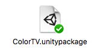
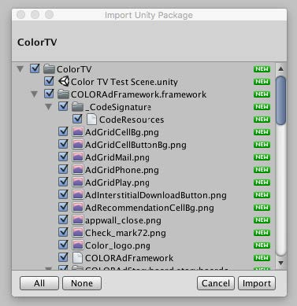
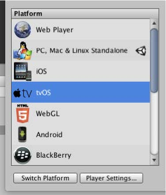
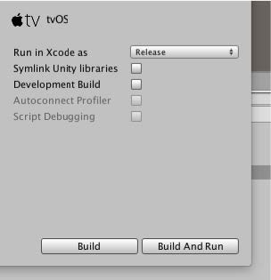

##Introduction
The ColorTV Unity Plugin is a light-weight plugin to provide functionality of the ColorTV SDK with Unity3D apps. Currently the plugin works only on actual tvOS devices, the Xcode simulator and Unity Editor will not show ads.

!!! note ""
    Current guide is prepared for Unity 5.3.1f1 version with XCode 7.2.
  
##Adding tvOS Unity Plugin

!!! note "Download"
    [Download the Unity tvOS Plugin here](https://www.dropbox.com/s/yj1j7699wb4nnjg/ColorTV.unitypackage?dl=0)
    
Double click the ReplayTV.unitypackage file

<center></center>

The plugin will open inside Unity, Click Import.

<center></center>

##Integrating the plugin to your game

Drag the ColorTVController’s Prefab into the scene’s hierarchy

<center></center>

Fill out your App ID value generated in the dashboard in ColorTVController’s inspector panel

<center></center>

##Showing Ads

Using SDK is as easy as referencing the ColorTVController prefab and executing the following method with two parameters:

```objective-c
ShowAd(enum ColorTVAdPlacement adPlacement)
```

The enum ColorTVAdPlacement can become the following:
-AppLaunch
-AppResume
-AppClose
-MainMenu
-Pause
-StageOpen
-StageComplete
-StageFailed
-LevelUp
-BetweenLevels
-StoreOpen
-InAppPurchase
-InAppPurchaseAbandoned
-VirtualGoodPurchase
-UserHighScore
-OutOfGoods
-OutOfEnergy
-InsufficientCurrency
-FinishedTutorial

An example scene is included with the plugin and can be found under ColorTV/ColorTV Test Scene.unity

!! note 
**Important**: In order for the buttons to be clickable you have to set the Unity Projects’ Input settings properly. Go to Edit>Project Settings>Input, Open Axes>Submit (first one) and put: joystick button 14 into All Positive Button field. Now build and run!

<center></center>

##Implementing Virtual Currency

In order to reward the user, you have to create a delegate method in one of your scripts: 

```objective-c
public void YourFunctionName (String jsonString){
Debug.Log ("User has received currency info “ + jsonString);
}
```

And then register the delegate by calling:

```objective-c
ColorTvController.Instance.OnCurrencyEvent += this.YourFunctionName;
```

Now you will be notified when a user earns virtual currency.

In order to distribute currency to the same user but on other device, use:

```objective-c
ColorTVController.RegisterUserId ("user123");
```

##Building the Project

In order for the plugin to work, you have to switch the project’s platform to tvOS.

Go to File > Build Settings...

<center></center>

Click on tvOS and Switch Platform

<center></center>

Click Build and Run

<center></center>

The XCode project will show up and run automatically on your AppleTV.
